# Happle 予約システム アーキテクチャ

## 1. システム概要

hacomono Admin APIを使用した「黄土韓方よもぎ蒸し Happle」のゲスト向けオンライン予約システム。

## 2. システム構成

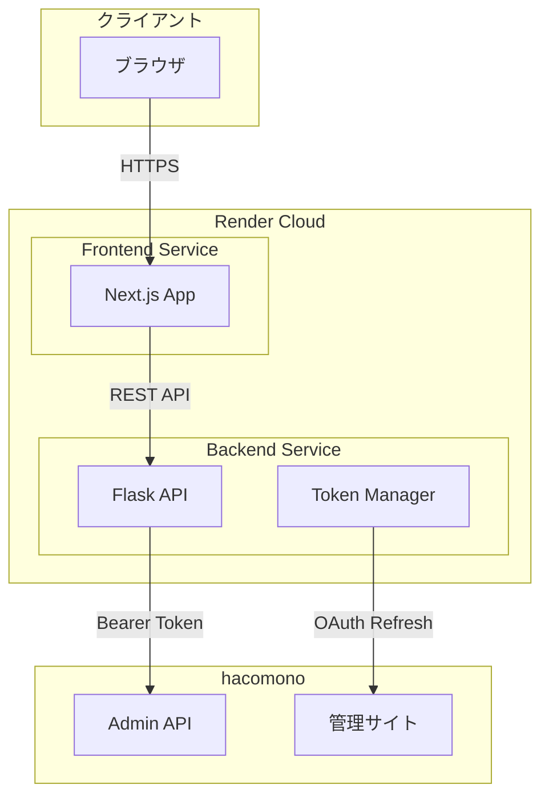

## 3. ユーザーフロー

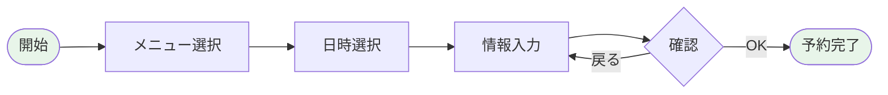

### 画面遷移

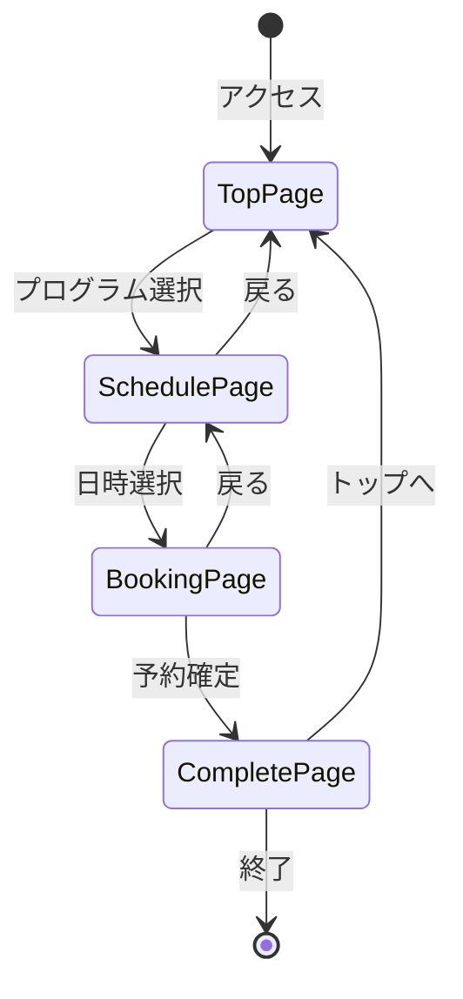

## 4. 予約作成シーケンス

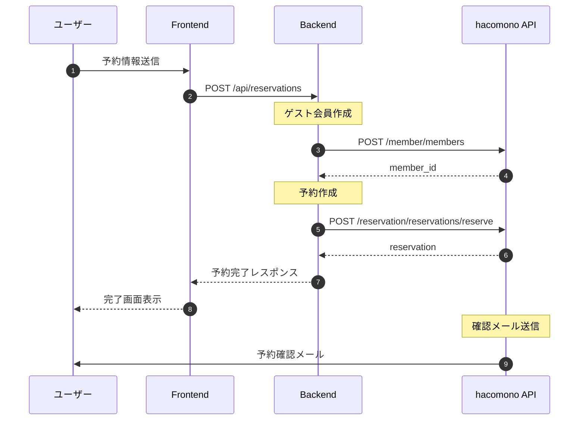

## 5. API設計

### エンドポイント一覧

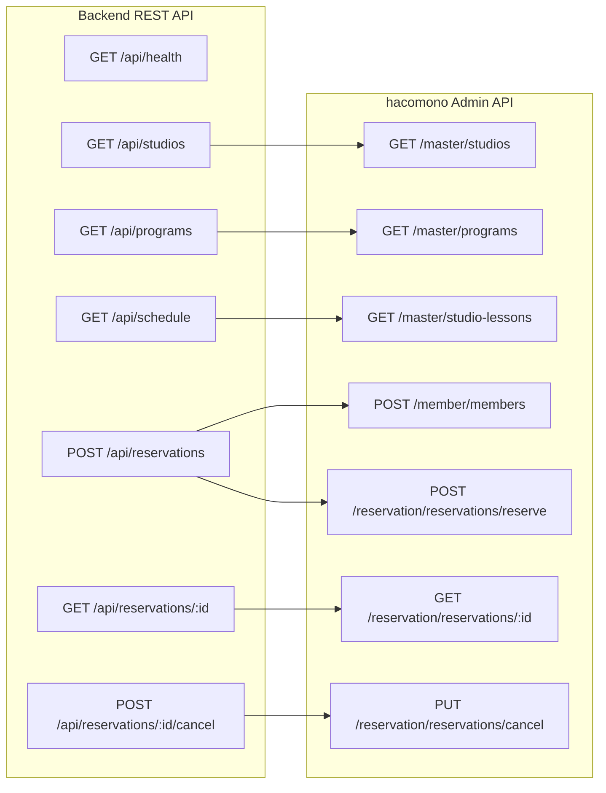

### データフロー

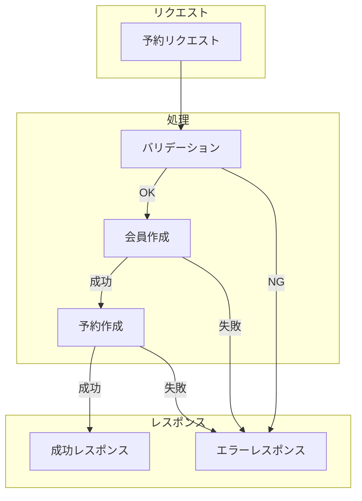

## 6. 認証フロー

### OAuth 2.0 Authorization Code Grant

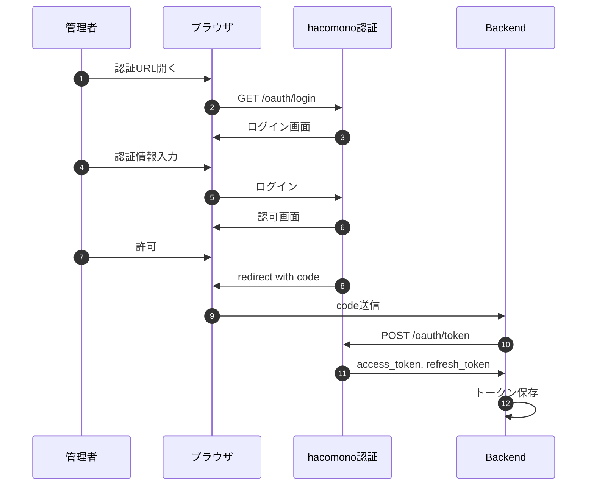

### トークンリフレッシュ

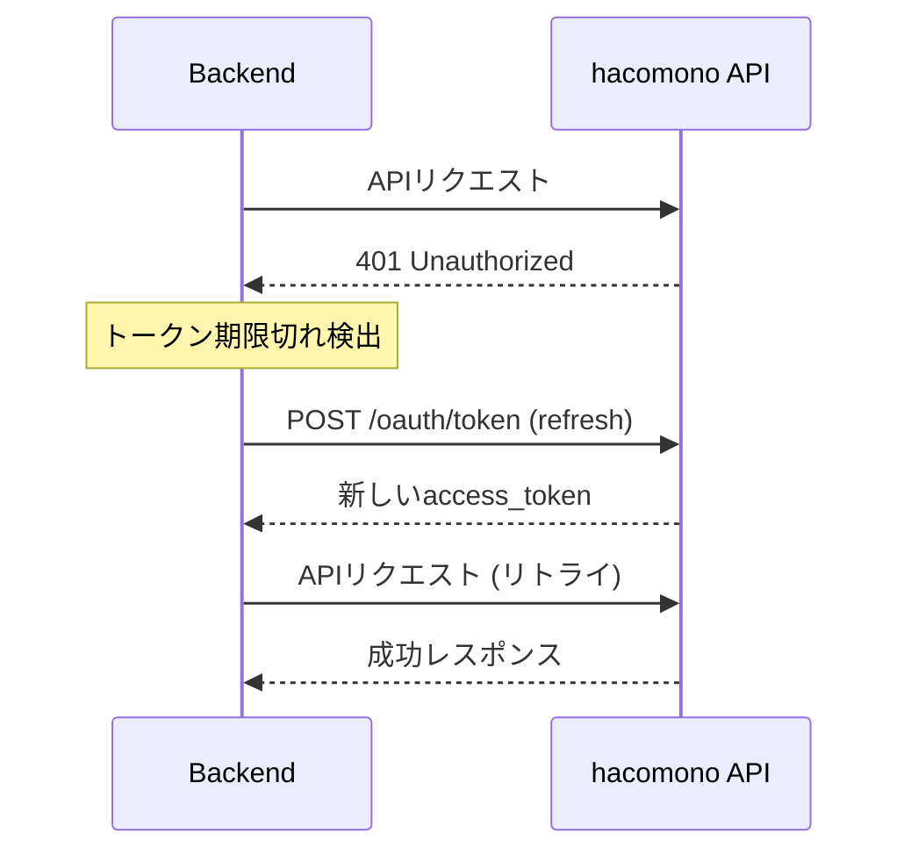

## 7. 技術スタック

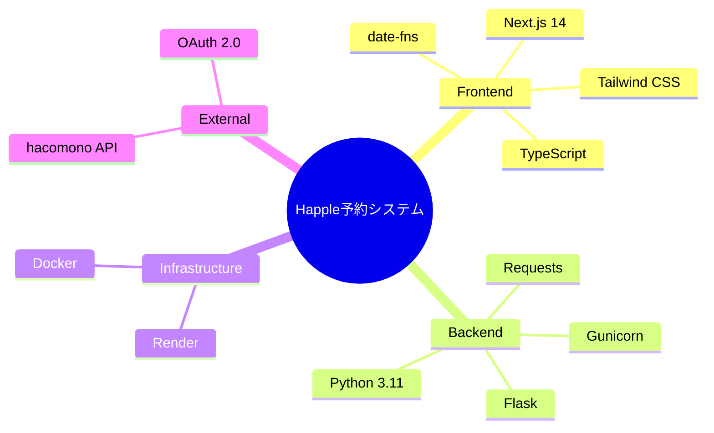

## 8. デプロイ構成

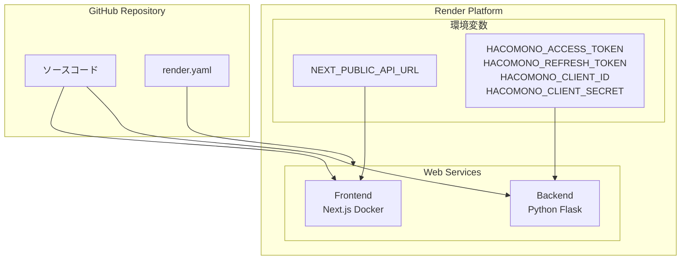

## 9. エラーハンドリング

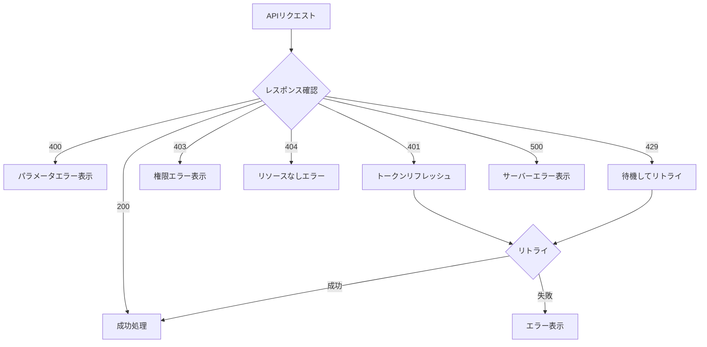

## 10. セキュリティ

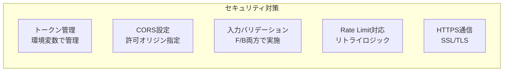

## 11. 今後の拡張

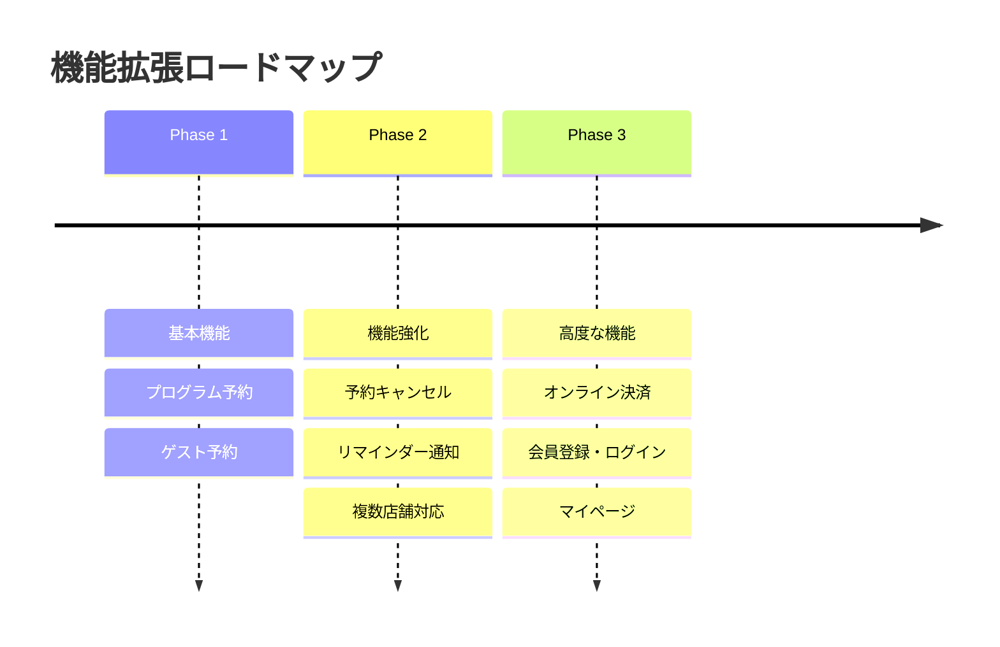
