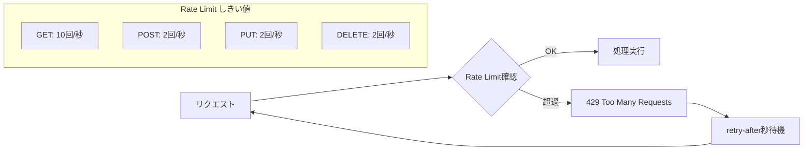
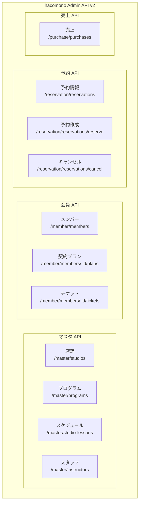
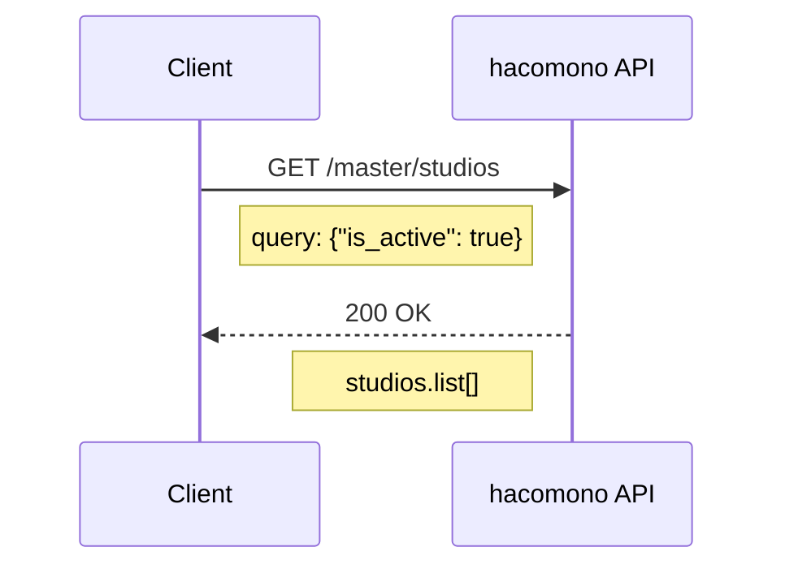
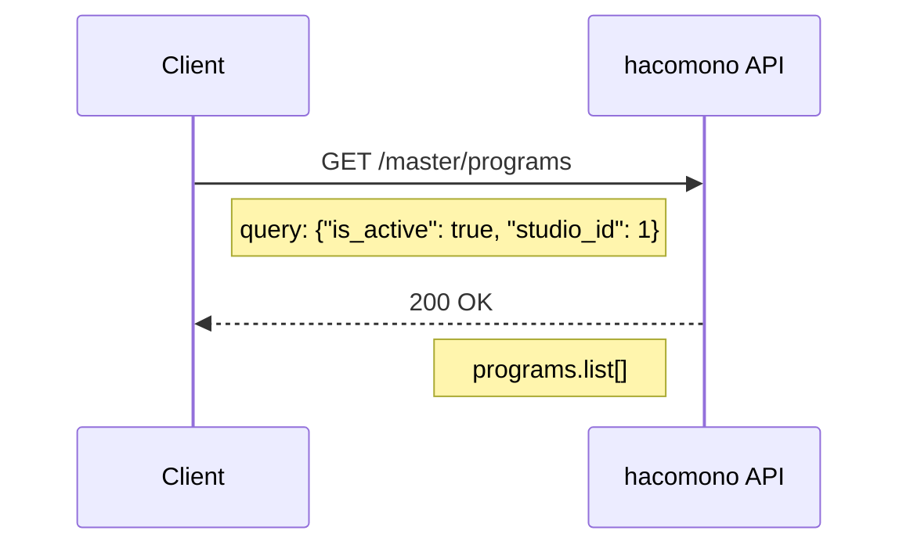
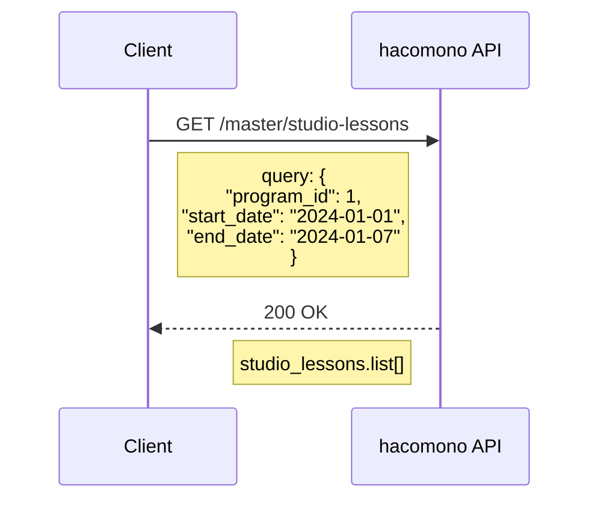
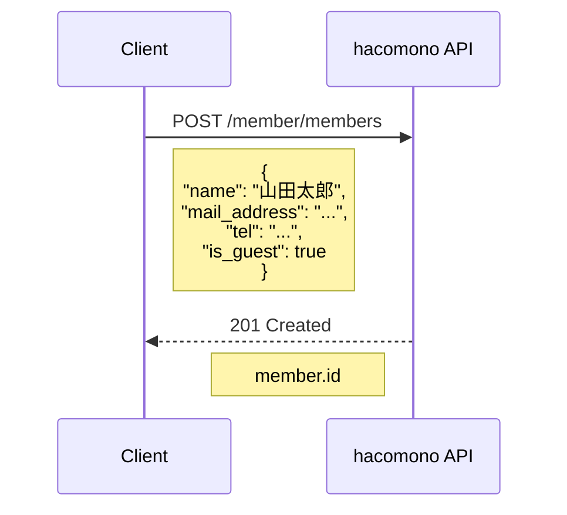
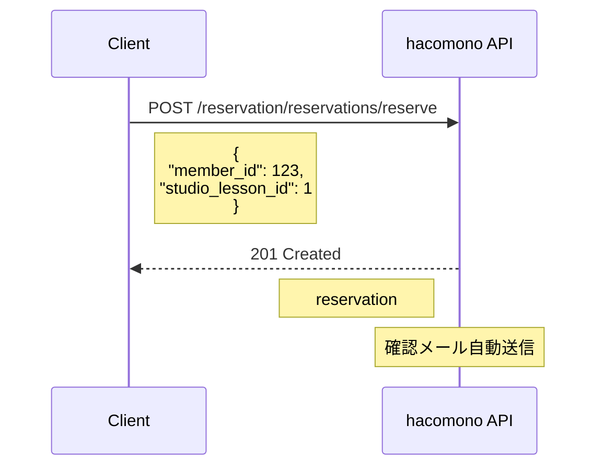
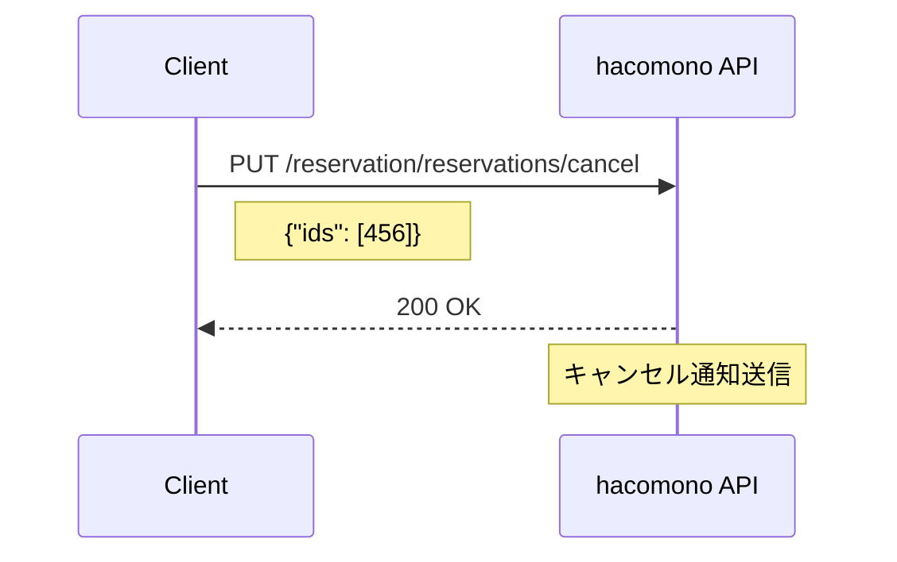
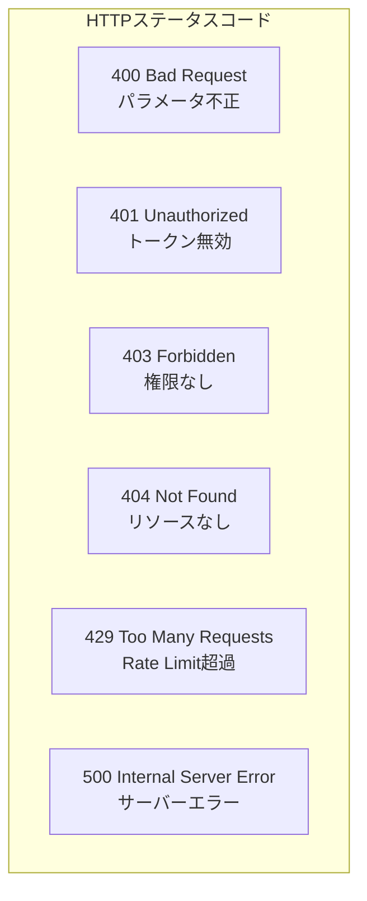
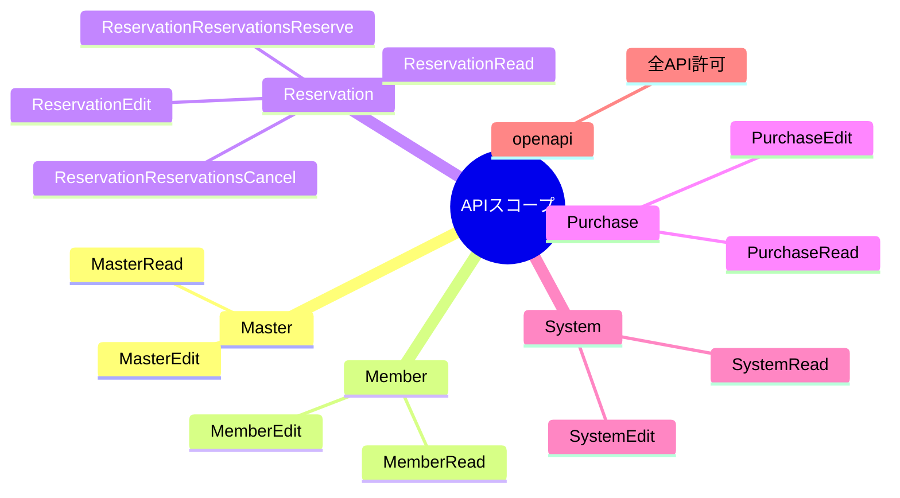

# hacomono API リファレンス

## 1. 基本情報

| 項目 | 値 |
|------|-----|
| エンドポイント | `https://{brand_code}.admin.egw.hacomono.app/api/v2/` |
| 認証方式 | Bearer Token |
| Content-Type | application/json |

## 2. Rate Limit



## 3. 認証ヘッダー

```
Authorization: Bearer {access_token}
X-Requested-With: XMLHttpRequest
Content-Type: application/json
```

## 4. API構成



## 5. 使用API詳細

### 5.1 店舗一覧取得



**リクエスト**
```
GET /master/studios?query={"is_active":true}
```

**レスポンス**
```json
{
  "data": {
    "studios": {
      "length": 50,
      "page": 1,
      "total_count": 3,
      "list": [
        {
          "id": 1,
          "name": "黄土韓方よもぎ蒸し Happle",
          "code": "S0001",
          "status": 1,
          "prefecture": "東京都",
          "address1": "渋谷区...",
          "tel": "03-xxxx-xxxx",
          "business_hours": "10:00-20:00"
        }
      ]
    }
  }
}
```

### 5.2 プログラム一覧取得



**リクエスト**
```
GET /master/programs?query={"is_active":true,"studio_id":1}
```

**レスポンス**
```json
{
  "data": {
    "programs": {
      "list": [
        {
          "id": 1,
          "name": "よもぎ蒸し60分",
          "code": "P0001",
          "description": "黄土よもぎ蒸し",
          "duration": 60,
          "capacity": 1,
          "price": 5000,
          "status": 1
        }
      ]
    }
  }
}
```

### 5.3 スケジュール取得



**リクエスト**
```
GET /master/studio-lessons?query={
  "is_active": true,
  "studio_id": 1,
  "program_id": 1,
  "start_date": "2024-01-01",
  "end_date": "2024-01-07"
}
```

**レスポンス**
```json
{
  "data": {
    "studio_lessons": {
      "list": [
        {
          "id": 1,
          "studio_id": 1,
          "program_id": 1,
          "program_name": "よもぎ蒸し60分",
          "instructor_id": 1,
          "instructor_name": "スタッフA",
          "start_at": "2024-01-01T10:00:00+09:00",
          "end_at": "2024-01-01T11:00:00+09:00",
          "capacity": 1,
          "reserved_count": 0,
          "is_reservable": true
        }
      ]
    }
  }
}
```

### 5.4 メンバー作成



**リクエスト**
```json
POST /member/members
{
  "name": "山田太郎",
  "name_kana": "ヤマダタロウ",
  "mail_address": "example@email.com",
  "tel": "090-1234-5678",
  "is_guest": true,
  "studio_id": 1,
  "note": "Web予約ゲスト"
}
```

**レスポンス**
```json
{
  "data": {
    "member": {
      "id": 123,
      "name": "山田太郎",
      "mail_address": "example@email.com",
      "status": 1
    }
  }
}
```

### 5.5 予約作成



**リクエスト**
```json
POST /reservation/reservations/reserve
{
  "member_id": 123,
  "studio_lesson_id": 1,
  "note": "Web予約"
}
```

**レスポンス**
```json
{
  "data": {
    "reservation": {
      "id": 456,
      "member_id": 123,
      "studio_lesson_id": 1,
      "status": 1,
      "start_at": "2024-01-01T10:00:00+09:00",
      "end_at": "2024-01-01T11:00:00+09:00",
      "created_at": "2024-01-01T09:00:00+09:00"
    }
  }
}
```

### 5.6 予約キャンセル



**リクエスト**
```json
PUT /reservation/reservations/cancel
{
  "ids": [456]
}
```

## 6. エラーレスポンス



**エラーレスポンス形式**
```json
{
  "errors": [
    {
      "code": "ERROR_CODE",
      "message": "エラーメッセージ"
    }
  ],
  "data": null
}
```

## 7. スコープ一覧



## 8. 実装例

### Rate Limit対策

```python
def handle_rate_limit(response):
    if response.status_code == 429:
        retry_after = int(response.headers.get("retry-after", 1))
        time.sleep(retry_after)
        return True  # リトライ必要
    return False
```

### トークンリフレッシュ

```python
def refresh_token():
    response = requests.post(
        f"https://{admin_domain}/api/oauth/token",
        json={
            "grant_type": "refresh_token",
            "refresh_token": refresh_token,
            "client_id": client_id,
            "client_secret": client_secret
        }
    )
    return response.json()
```
