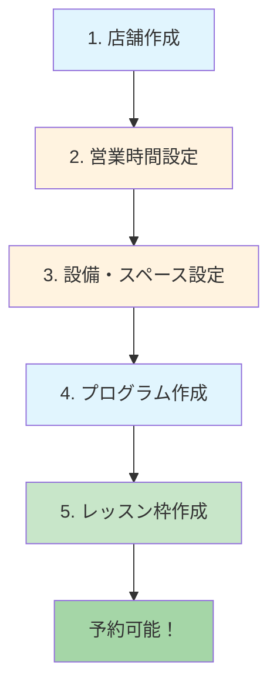

# Happle 予約システム セットアップガイド

## 📋 予約システムに必要な設定

予約システムを動作させるには、hacomono管理画面で以下の設定が必要です。



## 1. 店舗（Studio）設定

### 管理画面での設定場所
- **メニュー**: マスタ → 店舗

### 必要な情報
| 項目 | 説明 | 必須 |
|------|------|:----:|
| 店舗名 | 表示される店舗名 | ✅ |
| 店舗コード | 一意の識別コード | ✅ |
| 住所 | 店舗の住所 | - |
| 電話番号 | 連絡先 | - |

### API
```
GET /master/studios  # 店舗一覧取得
```

---

## 2. 営業時間設定 ⚠️ 重要

### 管理画面での設定場所
- **メニュー**: マスタ → 店舗 → 営業時間設定

### 必要な設定
| 項目 | 説明 | 必須 |
|------|------|:----:|
| 営業曜日 | 営業する曜日を選択 | ✅ |
| 営業開始時間 | 開店時間（例: 09:00） | ✅ |
| 営業終了時間 | 閉店時間（例: 21:00） | ✅ |
| 定休日 | 定休日の設定 | - |

### ⚠️ 注意事項
- **営業時間外の予約はAPIでエラーになります**
- エラーコード: `RSV_000309`
- メッセージ: 「営業時間外の日時を指定することはできません。」

---

## 3. 設備・スペース設定

### 管理画面での設定場所
- **メニュー**: マスタ → 設備

### 必要な情報
| 項目 | 説明 | 必須 |
|------|------|:----:|
| 設備名 | 部屋/スペースの名前 | ✅ |
| 店舗 | 紐づける店舗 | ✅ |
| 定員 | 最大収容人数 | ✅ |
| スペース番号 | 予約時に使用 | ✅ |

### API
```
GET /master/studio-room-spaces  # スペース一覧取得
```

---

## 4. プログラム設定

### 管理画面での設定場所
- **メニュー**: マスタ → プログラム

### 必要な情報
| 項目 | 説明 | 必須 |
|------|------|:----:|
| プログラム名 | メニュー名 | ✅ |
| プログラムコード | 一意の識別コード | ✅ |
| 説明 | プログラムの説明文 | - |
| 所要時間 | 施術時間（分） | - |
| 料金 | 価格 | - |

### API
```
GET /master/programs  # プログラム一覧取得
```

---

## 5. レッスン枠（スケジュール）設定 ⚠️ 重要

### 管理画面での設定場所
- **メニュー**: 予約 → レッスン管理
- または **カレンダー** からシフトを設定

### 必要な情報
| 項目 | 説明 | 必須 |
|------|------|:----:|
| 店舗 | 対象の店舗 | ✅ |
| 設備/スペース | 使用するスペース (studio_room_space_id) | ✅ |
| プログラム | 提供するプログラム | ✅ |
| 担当スタッフ | インストラクター | ✅ |
| 日時 | 開始・終了時刻 | ✅ |
| 定員 | 予約可能人数 | ✅ |
| 公開日時 | published_at（null以外で公開） | ✅ |

### API でのレッスン作成例
```json
POST /master/studio-lessons
{
  "studio_id": 2,
  "program_id": 2,
  "instructor_id": 1,
  "studio_room_space_id": 20,
  "start_at": "2025-12-13T10:00:00+09:00",
  "end_at": "2025-12-13T11:00:00+09:00",
  "capacity": 3
}

// 作成後、公開設定が必要
PUT /master/studio-lessons/{id}
{
  "published_at": "2025-12-12T00:00:00+09:00"
}
```

### ⚠️ 注意事項
- **published_at がnullのレッスンは一覧APIに表示されません**
- レッスン作成後は必ず公開日時を設定してください

---

## 6. メンバー（ゲスト）作成

### API でのメンバー作成に必要なフィールド

| フィールド | 説明 | 必須 |
|-----------|------|:----:|
| last_name | 姓 | ✅ |
| first_name | 名 | ✅ |
| mail_address | メールアドレス | ✅ |
| plain_password | パスワード | ✅ |
| gender | 性別 (1=男性, 2=女性) | ✅ |
| birthday | 生年月日 (YYYY-MM-DD) | ✅ |
| tel | 電話番号 | - |
| studio_id | 所属店舗 | - |

### 例
```json
POST /member/members
{
  "last_name": "山田",
  "first_name": "太郎",
  "mail_address": "test@example.com",
  "plain_password": "SecurePassword123!",
  "gender": 1,
  "birthday": "1990-01-01",
  "tel": "090-1234-5678",
  "studio_id": 2
}
```

---

## 7. 予約作成

### 自由枠予約 API

```
POST /reservation/reservations/choice/reserve
```

### 必須パラメータ
| パラメータ | 説明 |
|-----------|------|
| member_id | メンバーID |
| studio_room_id | 設備ID |
| program_id | プログラムID |
| start_at | 開始日時 |
| end_at | 終了日時 |

### 例
```json
POST /reservation/reservations/choice/reserve
{
  "member_id": 28,
  "studio_room_id": 5,
  "program_id": 2,
  "start_at": "2025-12-13T10:00:00+09:00",
  "end_at": "2025-12-13T11:00:00+09:00"
}
```

---

## 🔗 関連リンク

### hacomono管理画面
- **Happle管理画面**: https://happle-admin.hacomono.jp/
- **レッスン管理**: https://happle-admin.hacomono.jp/#/master/studio-lessons
- **予約確認**: https://happle-admin.hacomono.jp/#/reservation/reservations

### API ドキュメント
- **Admin API**: https://hacomono.github.io/hacomono-documents/api-admin/index.html

---

## ❗ よくあるエラー

| エラーコード | メッセージ | 原因と対処 |
|-------------|----------|-----------|
| `CMN_000051` | 必須パラメータが含まれていません | 必須フィールドを追加 |
| `RSV_000309` | 営業時間外の日時を指定することはできません | **店舗の営業時間設定を確認** |
| `CMN_000020` | 不正なタイプです | パラメータの型を確認（例: gender は 1 or 2） |
| `CMN_000001` | エラーが発生しました | 一般的なエラー。パラメータを確認 |

---

## 📝 チェックリスト

予約システムを動作させる前に、以下を確認してください：

- [ ] 店舗が作成されている
- [ ] **営業時間が設定されている**（重要！）
- [ ] 設備/スペースが作成されている
- [ ] プログラムが作成されている
- [ ] レッスン枠が作成されている
- [ ] レッスン枠が**公開**されている（published_at ≠ null）
- [ ] 予約したい日時が営業時間内である

---

## ⚠️ 現在の課題と必要な設定

### 予約作成時のエラー

現在、レッスン予約API (`/reservation/reservations/reserve`) で汎用エラー `CMN_000001` が発生しています。

**確認済みの設定:**
- ✅ 店舗 (studio_id: 2)
- ✅ 営業時間設定
- ✅ 自由予約受付設定 (studio_room_service)
- ✅ プログラム (program_id: 2)
- ✅ レッスン枠 (studio_lesson_id: 223, 224, 225, 226)
- ✅ スペース設定 (studio_room_space_id: 20)
- ✅ チケット (ticket_id: 5 - Web予約チケット)
- ✅ メンバー作成
- ✅ チケット付与

**管理画面で確認が必要な項目:**
1. **予約設定** - 店舗の予約受付設定が有効か
2. **プログラムの予約設定** - プログラムが予約可能か
3. **チケットとプログラムの紐付け** - チケットがプログラムに使用可能か
4. **メンバータイプ** - メンバーが予約可能なタイプか

### 確認URL

- **店舗設定**: https://happle-admin.hacomono.jp/#/master/studios/2
- **プログラム設定**: https://happle-admin.hacomono.jp/#/master/programs/2
- **チケット設定**: https://happle-admin.hacomono.jp/#/master/tickets
- **予約確認**: https://happle-admin.hacomono.jp/#/reservation/reservations

---

## 🚀 ローカル開発環境

### 起動コマンド

```bash
# バックエンド (port 5021)
cd happle-reservation/backend
source venv/bin/activate
export PORT=5021
export HACOMONO_ACCESS_TOKEN=xxx
python app.py

# フロントエンド (port 3002)
cd happle-reservation/frontend
npm run dev -- -p 3002
```

### Docker Compose

```bash
cd happle-reservation
docker-compose up
```

- Backend: http://localhost:5021
- Frontend: http://localhost:3002

